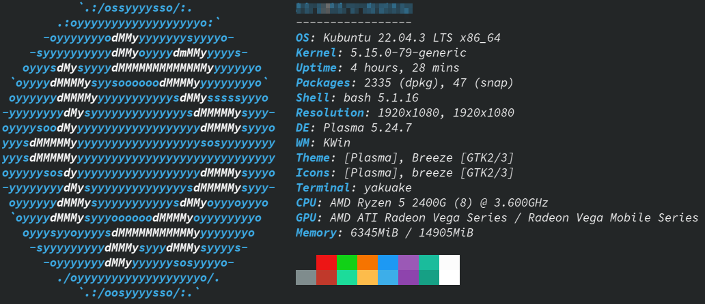

# keyv によるレコードの I/O 速度比較（私家版）

それぞれ 100 万レコードの出し入れに掛かる時間を計測。

```
1. redis
2. keyv -> redis
3. keyv -> PostgreSQL
```

- 環境

  ```bash
  neofetch
  ```

    
  近頃のノートパソコンより低性能なデスクトップ。

- 結果
  |No|Module|I/O|Seconds|
  |---|---|---|---|
  |1|redis-i.ts|I|<span style="color: #AE3EC9">56545.09305199981</span>|
  |2|redis-o.ts|O|<span style="color: #AE3EC9">51722.424607001245</span>|
  |3|keyv-redis-i.ts|I|102816.76917700097|
  |4|keyv-redis-o.ts|O|56545.95737599954|
  |5|keyv-postgres-i.ts|I|<span style="color: #b22222">573328.335539002</span>|
  |6|keyv-postgres-o.ts|O|<span style="color: #b22222">373854.6552070007</span>|

  当たり前だが、生の REDIS が一番速い。  
  ~~なんらかのケースで RDS を KEY-VALUE ストアにして使うこともあるのかも知れんが、速度が必要なケースでは悪手。~~  
  keyv 自体が Event Emitter を内蔵しているみたい。

## REDIS

- docker

  ```bash
  docker run --name some-redis --network host -d redis
  ```

- Node.js
  - input test
    ```bash
    npx ts-node redis-i.ts
    # 56545.09305199981
    ```
  - output test
    ```bash
    npx ts-node redis-o.ts
    # 51722.424607001245
    ```

## keyv -> REDIS

- Node.js
  - input test
    ```bash
    npx ts-node keyv-redis-i.ts
    # 102816.76917700097
    ```
  - output test
    ```bash
    npx ts-node keyv-redis-o.ts
    # 56545.95737599954
    ```

## keyv -> PostgreSQL

- docker

  ```bash
  docker run -d \
    --name some-postgres \
    -p 5432:5432 \
    -e LANG=ja_JP.utf8 \
    -e TZ=Aaia/Tokyo \
    -e POSTGRES_USER=<user> \
    -e POSTGRES_PASSWORD=<password> \
    -e POSTGRES_DB=<database> \
    postgres:16beta3-alpine3.18
  ```

- Node.js
  - input test
    ```bash
    npx ts-node keyv-postgres-i.ts
    # 573328.335539002
    ```
  - output test
    ```bash
    npx ts-node keyv-postgres-o.ts
    # 373854.6552070007
    ```

## Event Emitter

- Node.js
  ```bash
  npx ts-node emit.ts
  ```

## Special thanks to

- keyv  
  [https://github.com/jaredwray/keyv](https://github.com/jaredwray/keyv)
